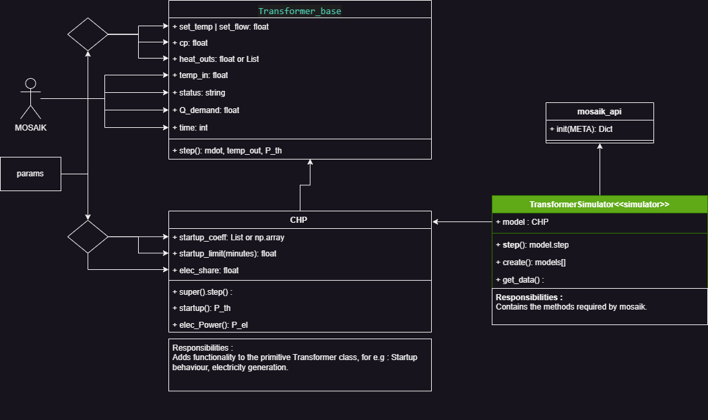

# CHP
This model inherits from the `Transformer_base` class. 
# Parameters
- ***elec_share*** : (float)The ratio of electric power generation to thermal power generation.
- ***startup_coeff*** : (array or List)Series of coefficients representing the startup behaviour.
- ***startup_time*** : (float) The startup time of the CHP (in minutes). 
# Structure
There are two classes : `CHP` and `TransformerSimulator`.
## CHP
This class is a child of the `Transformer_base` class.
Here the startup behaviour and the electricity generation of the CHP is modelled.
The startup behaviour is modelled using a linear equation, the order of which is determined by the number of coefficient provided in the parameters dictionary.
The electricity generation is defined simply as a ratio of the thermal power generation.
## TransformerSimulator
A child class of `mosaik_api.Simulator` class. Contains the methods requried by mosaik.  

# Structure
