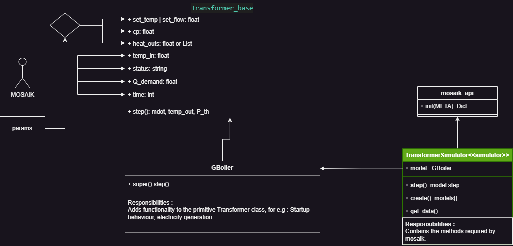

# Gas Boiler
This models inherits from the `Transformer_base` class. 
# Parameter
- ***startup_coeff*** : (array or List)Series of coefficients representing the startup behaviour.
- ***startup_time*** : (float) The startup time of the CHP (in minutes). 
# Structure
There are two classes : `Gboiler` and `TransformerSimulator`.
## Gboiler
This class is a child of the `Transformer_base` class.
The startup behaviour is modelled using a linear equation, the order of which is determined by the number of coefficient provided in the parameters dictionary.
## TransformerSimulator
A child class of `mosaik_api.Simulator` class. Contains the methods requried by mosaik.  

# Structure
