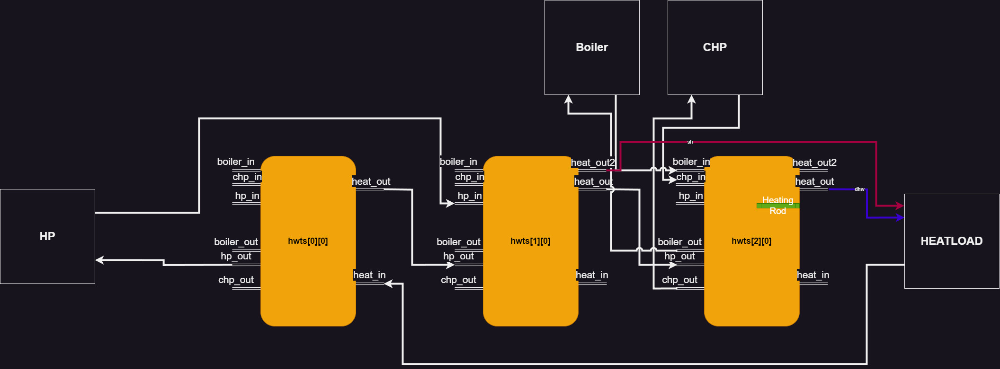

# Controller DES model

The controller build on top of the basic mosaik controller model.
The controller is responsible for the deciding the operation of the Heat pump, Combined heat and power plant, Gas boiler and the inbuilt heating rods.
The controller is also responsible for balancing the mass flow rates between the three storage tanks.

## Calculating heat supply
Based on the required heating, the mass flow rate of the hot water outlet is calculated.

## Mass balancing
The controller is also responsible for balancing mass flows between the storage tanks.  
*In the current configuration : *  
Return line from Network is connected to the first tank, as well as the inflow to the heat pump. The difference between this dictates the flow between the first and second tank. This flow could be in either direction, depending on the heat demand, i.e the flow rate of the Network return line.  
The second tank recieves the hot water from the Heat pump, this along with the balancing flow between first and second tanks, dictates the flow into the third tank.  
The third tank recieves flow from the CHP and the gas boiler, both of which form a closed loop with the third tank.  

## Controller Logic - Heating mode
### Heat Pump
The heat pump is turned on when the temperature of the bottom layer of the first tank is below the threshold temperature, *T_sp_l*.
The Heat pump is turned off only when the temperature of the bottom layer crosses the upper threshold temperature, *T_sp_h*.

### CHP and Gas Boiler
The CHP is turned on when the top layer of the third storage tank is below the upper threshold temperature, *T_sp_h*. The CHP continues running until the bottom layer of the third tank is above the upper threshold temperature, *T_sp_h*. 
The Gas boiler is turned on if the temperature of the top layer of third storage tank is below *T_sp_h* for more than *10 mins* **(dt)**.   The gas boiler runs in conjuction with the CHP until the bottom layer of the third tanks is above the upper threshold temperature, *T_sp_h*.
 

