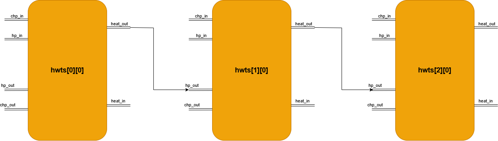
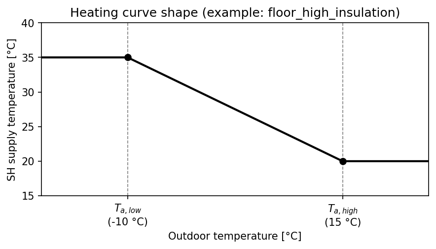

# Controller — Configuration Guide

## Overview

The controller monitors tank sensor temperatures to decide when generators (heat pump, CHP, boiler) should switch on or off. It also takes the current space heating and DHW demand and computes the water flow rates needed to meet that demand from the available tanks.

## DHN configuration

The pipe configuration defines how space heating (SH) and domestic hot water (DHW) circuits are physically connected to the tanks. `supply_config` should be set to one of the following options.

### 2-pipe

One shared supply pipe and one shared return pipe serve all consumers. SH and DHW are not separated — the controller works with a single combined `heat_demand`. This is the simplest topology.

The following params must be set:
- `supply_conn` — tank port to draw heat from
- `return_conn` — tank port for the return flow
- `T_dhn_sp` — DHN setpoint temp

### 3-pipe

SH and DHW have separate supply pipes but share a single return. The controller computes flow for each circuit independently.

The following params must be set:
- `sh_out` — tank port for space heating supply
- `dhw_out` — tank port for DHW supply
- `return_conn` — shared return port

### 4-pipe

SH and DHW have fully separate supply and return pipes. This is the most detailed topology and allows independent return temperatures for each circuit.

The following params must be set:
- `sh_out` — tank port for space heating supply
- `dhw_out` — tank port for DHW supply
- `sh_ret` — dedicated space heating return port
- `dhw_ret` — dedicated DHW return port

## Parameters

### Required — all configurations

| Parameter | Type | Unit | Description |
|---|---|---|---|
| `supply_config` | str | — | DHN topology. Must be `"2-pipe"`, `"3-pipe"` or `"4-pipe"`. See DHN configuration above. |
| `gens` | list[str] | — | Names of the generators in the system, e.g. `["hp", "chp", "boiler"]`. Every name listed here must have a corresponding entry in `logic`, otherwise that generator will not run. |
| `NumberofTanks` | int | — | Number of tanks in the system. Tanks are indexed from 0, so `3` creates `tank0`, `tank1`, `tank2`. |
| `logic` | dict | — | Heuristic rules defining when each generator turns on and off. See Generator control logic below. |
| `tank` | dict | — | Tank configuration shared across all tanks (volume, connections, sensors, heating rods). |
| `TankbalanceSetup` | list[str] | — | Required when `NumberofTanks > 1`. Defines how heat flows between tanks. See Tank balancing below. |

### Optional

| Parameter | Type | Unit | Default | Description |
|---|---|---|---|---|
| `heating_curve` | str | — | `"floor_high_insulation"` | Heating curve for SH supply temperature calculation. Used in `3-pipe` and `4-pipe` only. See Heating curves below. |
| `dhw_Tdelta` | float | °C | `15` | Temperature difference between DHW supply and return. Used to compute DHW flow rate. |
| `T_dhw_sp` | float | °C | `65` | DHW supply temperature setpoint. Used by the ideal heating rod when `Ideal_hr_mode` is `"on"`. |
| `heat_dT` | float | °C | `15` | Temperature difference between supply and return used to compute flow rate in `2-pipe` config. |
| `Ideal_hr_mode` | str | — | `"off"` | When set to `"on"`, enables an ideal backup heater that covers any supply deficit. Useful for identifying undersized components. |
| `control_strategy` | str | — | `"1"` | Generator control strategy. Currently only `"1"` is supported. |
| `operation_mode` | str | — | `"heating"` | Operating mode of the system. Currently only `"heating"` is supported. |


## Generator control logic

The `logic` dict defines the heuristic rules for each generator — when to turn it on and off based on a tank sensor reading. Every generator listed in `gens` must have an entry here, otherwise it will not run.

### Structure

Each generator entry follows this pattern:

```json
"logic": {
    "chp": {
        "turn_on": {
            "tank": "tank2",
            "layer": "sensor_2",
            "turn_on_temp": 65
        },
        "turn_off": {
            "tank": "tank2",
            "layer": "sensor_2",
            "turn_off_temp": 75
        }
    }
}
```

- `tank` — which tank to monitor, e.g. `"tank2"`. Must match a tank index created by `NumberofTanks`. Tanks are indexed from 0.
- `layer` — which sensor layer on that tank to read, e.g. `"sensor_2"`. Sensors are indexed from 0.
- `turn_on_temp` — the generator turns on when the sensor reading drops at or below this value [°C].
- `turn_off_temp` — the generator turns off when the sensor reading rises at or above this value [°C]. If omitted, defaults to `turn_on_temp + 5 °C`.

### Additional conditions

`add_conditions` can be added to override the temperature rule with a secondary signal. There are two "standard" 'add_conditions' that could be added:

```json
"add_conditions": {
    "turn_on": { "battery_full": ["==", "True"] }
}
```

This turns the generator on whenever `battery_full` equals `"True"`, regardless of tank temperature.

```json
"add_conditions": {
    "turn_on" : {"hp_surplus" : ["==", "True"]}
}
```

This turns the generator (ideally the heat pump) on whenever `hp_surplus` equals `"True"`. `hp_surplus` is True when the local electricity generation (PV + CHP generation) is more than the local electricity consumption (households) needed for that point of time. 

Custom additional conditions could be set using the supported operators: `<`, `>`, `<=`, `>=`, `==`.

For example:

```json
"add_conditions": {
    "turn_off" : {"T_amb" : ["<=", 5]}
}
```
This is an example where a condition could be added to the heat pump to turn it off when ambient temp is equal to or below 5°C.

## Tank balancing

When the system has more than one tank (`NumberofTanks > 1`), the controller needs to know if those tanks are connected to each other and if so how they are connected to each other. `TankbalanceSetup` is a list of links, where each link is written as `"source:destination"` using dot notation — `tankN.port_name`.

For example:

```
"TankbalanceSetup": [
    "tank0.heat_out:tank1.hp_out",
    "tank1.heat_out:tank2.hp_out"
]
```




Each entry means: balance the residual flow from the source tank port into the destination tank port. The controller calculates whether there is a net surplus or deficit of flow in the source tank at each timestep and routes it accordingly. The direction of flow can go either way depending on the balance.


> ⚠ Port names used here must match ports defined in `tank.connections`.

## Heating curves

The heating curve determines the space heating supply temperature based on the 24h average of the ambient temperature. The controller interpolates linearly between two endpoints defined by each curve.

The `heating_curve` parameter should be chosen based on the building's heating system type and insulation level. for eg. this is what the heating curve if the option `floor_high_insulation` is chosen:



The supply temperature will be 35 °C at -10 °C outdoor and 20 °C at 15 °C outdoor, with linear interpolation in between. ΔT is the fixed difference between supply and return used for flow rate calculations.

Available ranges for the heating curves are:

| Option | Ta, low [°C] | Ta, high [°C] | Supply temp at Ta, low [°C] | Supply temp at Ta, high [°C] | ΔT [°C] |
|---|---|---|---|---|---|
| `radiator_low_insulation` | -10 | 15 | 75 | 45 | 20 |
| `radiator_high_insulation` | -10 | 15 | 55 | 35 | 15 |
| `floor_low_insulation` | -10 | 15 | 45 | 25 | 5 |
| `floor_high_insulation` | -10 | 15 | 35 | 20 | 5 |
| `Durlach_mes` | 0 | 10 | 60 | 52 | 15 |


> `Durlach_mes` is a measured curve specific to one project and may not be suitable for general use.

## Reference

### Controller

`ctrl = Controller(params)`

**Output attributes**

- `sh_supply` — float [W]: heat supplied to the space heating circuit in the current timestep. Used in `3-pipe` and `4-pipe` only.
- `dhw_supply` — float [W]: heat supplied to the DHW circuit in the current timestep. Used in `3-pipe` and `4-pipe` only.
- `heat_supply` — float [W]: total heat supplied. Used in `2-pipe` config only.
- `generators` — dict: per-generator status and demand, e.g. `generators['hp_status']`, `generators['hp_demand']`.
- `tank_connections` — dict: per-tank port temperatures and flow rates, e.g. `tank_connections['tank1']['heat_out_T']`.
- `IdealHrodsum` — float [W]: total power supplied by the ideal backup heater. This is used to detect and quantify heat supply deficits, either because the generators are not able to supply the heat demand or because the temperature falls below the needed level.
- `hwt0_hr_1` — float [W]: heating rod power setpoint sent to each tank at the current timestep. if there is more than one tank every tank will have one depending on the tank id, for eg. the second tank would be `hwt1_hr_1` and so on.

**Methods**

- `step(time)` — advances the controller by one timestep. Reads sensor temperatures, applies generator logic, computes supply flows, and updates tank balancing.
- `validate_params(params)` — validates the configuration before the simulation starts. Raises `IncompleteConfigError` if required parameters are missing or inconsistent.
- `calc_heat_supply(config)` — computes flow rates and temperatures for SH and DHW circuits based on the chosen pipe configuration.
- `supply_temp(out_temp, buildingtype)` — returns the SH supply temperature and delta-T from the selected heating curve depending on the 24h average of the ambient temperature. Used internally by `calc_heat_supply`.

## Exception

- `IncompleteConfigError` — raised by validate_params if there is a missing required param or a hard constraint from the param is missing.


## Sample parameters

Minimal example (constructing controller and performing one step):

```python
params = {
        "operation_mode": "heating",
        "control_strategy": "1",
        "supply_config": "4-runner",
        "heating_curve": "floor_low_insulation",
        "sh_out" : "tank1.heat_out2",
        "dhw_out" : "tank2.heat_out",
        "sh_ret" : "tank0.heat_in",
        "dhw_ret" : "tank2.heat_in",
        "boiler_mode": "on",
        "Ideal_hr_mode": "off", 
        "gens" : ["hp", "chp", "boiler"],
        "NumberofTanks" : 3,
        "TankbalanceSetup" : ["tank0.heat_out:tank1.hp_out", "tank1.heat_out:tank2.hp_out"],
        "logic" : {
            "chp" : {
                "turn_on" : {
                    "tank" : "tank2",
                    "layer" : "sensor_2",
                    "turn_on_temp" : 65
                },
                "turn_off" : {
                    "tank" : "tank2",
                    "layer" : "sensor_2",
                    "turn_off_temp" : 75
                }
            },
            "hp" : {
                "turn_on" : {
                    "tank" : "tank1",
                    "layer" : "sensor_2",
                    "turn_on_temp" : 40
                },
                "turn_off" : {
                    "tank" : "tank1",
                    "layer" : "sensor_2",
                    "turn_off_temp" : 65
                },
                "add_conditions" :{ 
                            "turn_on" : {"battery_full" : ["==", "True"]}
            }
            },
            "boiler" : {
                "turn_on":{
                    "tank" : "tank2",
                    "layer" : "sensor_2",
                    "turn_on_temp" : 64
                }
            }
        }

    } 
```

## Developer notes & assumptions

- Many defaults and helper functions live outside this module (for example `helpers.get_nested_attr` and `helpers.set_nested_attr`). The doc assumes those helpers behave as implied by their names.
