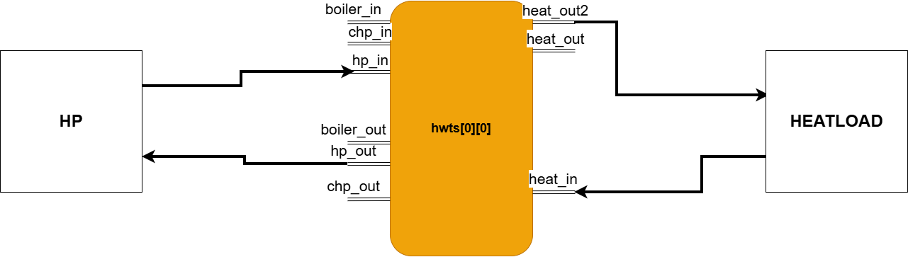
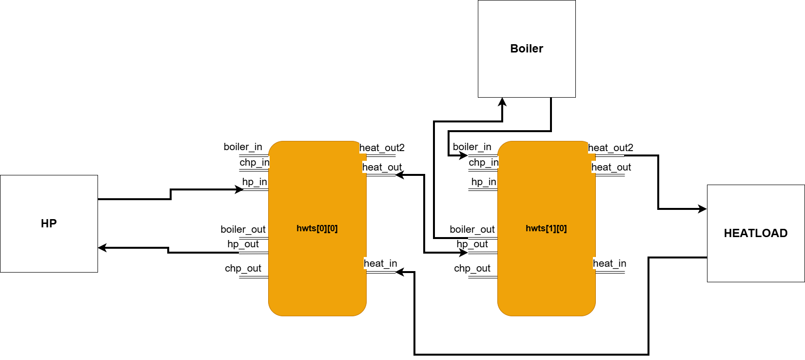
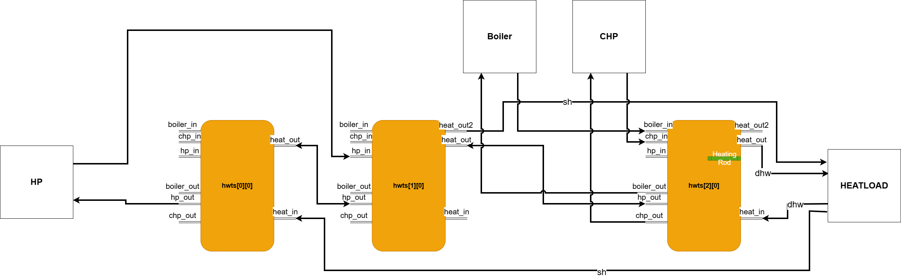

# main_sim.py — Configuration Guide

## Overview

The main simulation file acts as the integration layer of the DES setup.
Its role is to assemble configured subsystem models into one executable scenario, run the simulation timeline, and export results.

Model-level behavior is defined in each model block.
System-level behavior depends on how those blocks are combined and connected in the simulation run.

## Model configuration guides

- Controller — [controller.md](controller.md)
- Gas Boiler — [gasboiler.md](gasboiler.md)
- CHP — [chp.md](chp.md)
- PV — [pv.md](pv.md)

## Input setup

The simulation is configured through one input dictionary.
That dictionary is structured as named configuration blocks.

Input file used by the run:
- [data/inputs/input_params.json](../data/inputs/input_params.json)

Reference examples (planned):
- [data/inputs/examples/](../data/inputs/examples/)

The active input file is intended for scenario-specific edits.
The examples folder is intended as a reference library for alternative scenario setups.

### Core blocks

These blocks define scenario structure and startup state:

- `ctrl` — controller logic, supply routing, and switching behavior
- `tank` — tank geometry, ports, sensor layout, and thermal properties
- `init_vals_tank` — initial tank temperatures and startup state

### Component blocks (scenario-dependent)

These blocks are included only when the component is active in the scenario:

- `hp` — include when heat pump is part of the run
- `chp` — include when CHP is part of the run
- `boiler` — include when boiler is part of the run
- `pv` — include when PV generation is part of the run
- `battery` — include when electrical storage is part of the run

### Example of one configuration block
```json
"boiler": {
  "nom_P_th": 200000,
  "set_temp": 75,
  "efficiency": 0.8,
  "heating_value": 10833.3
}
```
## Setup flow

A stable setup usually follows this order:

1. Define scenario composition
   Decide which components are active and which blocks are needed.

2. Configure the system core
   Set `tank`, `init_vals_tank`, and `ctrl` first, so routing and control references have a stable base.

3. Add active component blocks
   Add `hp`, `chp`, `boiler`, `pv`, and `battery` only where used.

4. Align control references with active components
   Ensure `ctrl.gens` and `ctrl.logic` reflect only the components intended for the simulation.

5. Run consistency checks before execution
   Verify naming and references across blocks, not only values inside single blocks.

## Configuration consistency checks

Some issues are caught by individual model validation, but many setup problems are integration-level and appear only when blocks are combined.

### Generator alignment

Expected pattern:
- `ctrl.gens` lists active generators
- `ctrl.logic` contains matching generator entries (see [Controller — Generator control logic](controller.md#generator-control-logic) for detailed logic structure and options)
- corresponding component blocks exist in input

Example:
```json
"ctrl": {
  "gens": ["hp", "boiler"],
  "logic": {
    "hp": { ... },
    "boiler": { ... }
  }
}

"hp": { ... }
"boiler": { ... }
```
### Tank and port alignment

Expected pattern:
- tank IDs used in control logic exist in the scenario
- ports referenced in routing/balancing exist in `tank.connections`

Example:
```json
"TankbalanceSetup": [
  "tank0.heat_out:tank1.hp_out"
]

"tank": {
  "connections": {
    "heat_out": { ... },
    "hp_out": { ... }
  }
}
```
### Initialization alignment

Expected pattern:
- all runtime tank instances have matching initial-value entries in `init_vals_tank`

Example:
```json
"init_vals_tank": {
  "init_vals_hwt0": { ... },
  "init_vals_hwt1": { ... },
  "init_vals_hwt2": { ... }
}
```
## Implementation notes

The orchestration code in main_sim consists of coupled sections that must stay synchronized.

### Understanding the orchestration structure

For background on main simulation setup concepts in mosaik (world, simulators, entities, and connections), see:

- [Scenario API and setup documentation](https://mosaik.readthedocs.io/en/latest/scenario-definition.html)
- [mosaik GitLab repository docs](https://gitlab.com/mosaik/mosaik/-/tree/develop/docs?ref_type=heads)

The following section describes how those concepts are applied in this project-specific main_sim setup.

The main_sim function performs these distinct operations in order:

1. Simulator registry setup (sim_config dict)
   Declares which simulator classes will be used.

2. Model instantiation (world.start and .create calls)
   Creates entity instances from the registered simulators.

3. Signal wiring (world.connect calls)
   Establishes data flow between entities.

4. Data export setup (csv_writer and collector connections)
   Routes model outputs to result files and memory.

5. Execution (world.run)
   Runs the assembled scenario.

### What happens when sections are inconsistent

- If a component is registered but not instantiated, the registry is unused.
- If a component is instantiated but not connected, its signals are not available.
- If a component is connected but not exported, its output is lost.
- If a component is removed from input but still wired in main_sim, entity-not-found errors occur at runtime.

### General pattern for modifications

When configuration changes are planned:

1. Update input_params.json
   Add or remove the component block and controller references.

2. Update simulator registry
   Add or remove the simulator entry in sim_config.

3. Update instantiation
   Add or remove world.start() and .create() calls.

4. Update signal wiring
   Add or remove world.connect() calls for that component.

5. Update data export
   Add or remove csv_writer and collector connections.

### Finding sections in main_sim.py

Each section is logically grouped but scattered through the code:
- Simulator registry: near the start of run_DES function
- Instantiation: in the entity creation block
- Signal wiring: in the world.connect section
- Data export: in the CSV writer and collector section
- Execution: world.run() call near the end

When modifying, search for the component name throughout the file to ensure all occurrences are updated.

## Example scenarios

The following scenarios provide runnable references.  
Each scenario contains a paired `main_sim.py` and `input_params.json`.

### Scenario 1 


- Components: hp
- Number of Tanks: 1
- main_sim file: [main_sim.py](../data/inputs/examples/scenario_1/main_sim.py)
- Inputs file: [input_params.json](../data/inputs/examples/scenario_1/input_params.json)


### Scenario 2 


- Components: hp, pv, boiler
- Number of Tanks: 2
- main_sim file: [main_sim.py](../data/inputs/examples/scenario_2/main_sim.py)
- Inputs file: [input_params.json](../data/inputs/examples/scenario_2/input_params.json)



### Scenario 3

- Components: hp, boiler, pv, battery, chp
- Number of Tanks: 3
- main_sim file: [main_sim.py](../data/inputs/examples/scenario_3/main_sim.py)
- Inputs file: [input_params.json](../data/inputs/examples/scenario_3/input_params.json)

